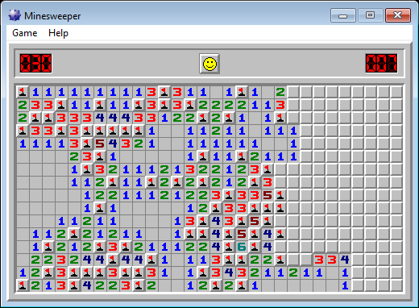
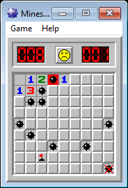

# Minesweeper

A C++/Win32 Minesweeper: three preset levels plus a custom field of any
size, question marks, chording, a clock, best times, sound, a monochrome
mode, zoom, window panning — and two hidden peeks.



*Expert, 30 × 16 with 99 mines, part way through.*



*Beginner, after stepping on a mine: the one you hit turns red, the rest are
revealed, and a flag in the wrong place gets a red X.*

```bash
build.cmd
```

produces `winmine.exe` next to `build.cmd`.

---

## Layout

| path | contents |
|---|---|
| `build.cmd` | builds `winmine.exe` |
| `src/miner.cpp` | the whole game, one translation unit |
| `src/miner.rc`, `src/resource.h` | menu, dialogs, strings, accelerators, version |
| `src/miner.manifest` | v6 common controls, and the DPI-aware flag |
| `res/*.bmp`, `res/miner.ico`, `res/*.wav` | artwork and sounds |
| `build/` | intermediate object/resource files |
| `docs/` | the screenshots above |
| `LICENSE` | WTFPL |

## Zoom and panning

**Ctrl + mouse wheel** zooms the whole interface in 25% steps — wheel up
to magnify, wheel down to shrink. There is no zoom-in ceiling of
principle: keep going and the window simply grows past the edge of the
screen, which is what the pan below is for. The only stop is the point
where the window gets too large for the window manager to place at all
(a 30,000 pixel edge — thousands of percent on any normal board).
Everything scales together: the artwork, the LED digits and the
one-pixel 3D edges. The interface is composed once at 1:1 onto an
offscreen surface and then stretched to the window with
nearest-neighbour sampling, so magnifying gives clean, hard-edged pixels
rather than a blurred interpolation.

Zooming centres on the **mouse pointer**: whatever square is under the
cursor stays under it, so you can zoom into a particular corner of a big
board without losing your place. The window is repositioned to make that
happen, and a board larger than the screen is deliberately *not* dragged
back on screen afterwards — that would throw away wherever you had
panned to.

The game opens at the display's own scale — 1:1 on a normal monitor, 2×
on a 200% display — so it comes up the size everything else on the
desktop is drawn at, and sharp, rather than half-size or blurred.

**Hold Space and drag with the left button**, or just **right-drag an
uncovered square**, to slide the window around from anywhere in the
playfield, like the hand tool in an image editor. (Right-dragging a
*covered* square still places a flag, as it always did - only squares
that are already open pan.)
The cursor changes while Space is held, and dragging never disturbs the
game underneath. This is what makes very large fields usable: zoom out
for an overview, then pan to reach the far corners.

The program is marked DPI-aware, so one game pixel is one screen pixel
and Windows never stretches and blurs the artwork; the zoom does all the
scaling, in whole pixels. The window also lifts the size limits Windows
applies by default (`WM_GETMINMAXINFO`), which would otherwise cap it
near the size of the work area and clip large boards along the bottom
and right.

One more wrinkle comes with boards bigger than the screen. The shell
treats any foreground window that covers the whole monitor as a
full-screen application and takes the taskbar out of always-on-top for
it — so panning a large board across the screen boundary made the
taskbar flicker in and out several times a second. The program calls
`ITaskbarList2::MarkFullscreenWindow(hwnd, FALSE)` to say it is not a
full-screen application, renewing the claim as the window moves, which
settles it.

## Settings and scores

Everything the game remembers — level, custom field size, window position,
Marks/Sound/Colour, and the three best times with their names — is kept in
**`winmine.ini`, in the same folder as `winmine.exe`**. Nothing is written to
the registry. The file is created on first run, as UTF-16 with a byte-order
mark so that non-ASCII player names survive a round trip:

```ini
[Minesweeper]
Difficulty=1
Height=16
Width=16
Mines=40
Mark=1
Color=1
Sound=0
Xpos=80
Ypos=80
Time1=999
Name1=Anonymous
...
```

`Difficulty` is 0–3 (beginner, intermediate, expert, custom). `Time1..3` are
the best times in seconds for the three preset levels.

## How it is drawn

Three pairs of bitmaps live in the resource file — a 4bpp colour version and a
1bpp monochrome one, chosen by the **Colour** menu item:

| id | size | contents |
|---|---|---|
| 410 / 411 | 16 × 256 | 16 field tiles of 16 × 16 |
| 420 / 421 | 13 × 276 | 12 LED digits of 13 × 23 |
| 430 / 431 | 24 × 120 | 5 smileys of 24 × 24 |

They are bottom-up DIBs, so tile 0 is the *last* 16 rows of the strip. The
game blits with `SetDIBitsToDevice` at `header + palette + index *
bytesPerTile`, and pre-renders the 16 field tiles into memory DCs at start-up
so the common case is a plain `BitBlt`.

The client area is `width*16 + 24` by `height*16 + 67`. Cell *(x, y)* is
blitted at `(x*16 - 4, y*16 + 39)`, and a click at client *(px, py)* maps back
to `((px + 4) >> 4, (py - 0x27) >> 4)`. The 3D edges all come from one routine
that walks `cThick` nested rectangles, using `R2_WHITE` for the highlight and a
grey (black, in mono) pen with `R2_COPYPEN` for the shadow.

## Board encoding

One byte per cell, in an array allocated to fit the field and surrounded by a
ring of `0x10` sentinels so the neighbour loops never need edge tests:

```
0x80  a mine is here
0x40  the cell has been uncovered
0x1F  tile index: 0-8 = the digits, 9 = '?' down, 10 = mine,
      11 = wrong flag, 12 = exploded, 13 = '?', 14 = flag,
      15 = untouched, 16 = off-board
```

## Rules worth spelling out

* the first cell uncovered is never a mine — if it is, the mine is relocated to
  the first free square found scanning rows/columns `1 .. n-1`;
* uncovering is a flood fill through a ring buffer, not recursion; the ring
  holds one entry per square, so it cannot lap itself and lose a pending one;
* chording (both buttons, middle button, or shift + left) only fires when the
  flag count around the cell equals its number, and pressing in shows the whole
  3×3 block;
* left-clicking an uncovered number flags or opens its neighbours, depending on
  what already adds up — see below;
* right-click cycles blank → flag → `?` → blank, and skips `?` when **Marks**
  is off; only the flag transitions move the mine counter;
* placing the last flag when every safe cell is already open wins the game;
* on a win the remaining mines become flags and the counter is driven to 0; on
  a loss the mines are revealed and wrong flags get a red X;
* the clock starts on the first button release over the field and stops at 999;
* minimising pauses the clock and restores it on the way back.

**Holding the left button repeats the click.** After a short pause -
long enough that an ordinary press-and-release is still a single click -
it fires every 10 ms, so the button can be held down and swept across
the board to open or flag a run of squares in one gesture. Releasing
stops it. (Windows clamps its timers to the system tick, so in practice
the repeats land every ~16 ms rather than exactly 10.)

F1 opens help, F2 starts a new game.

### Clicking a number

**Left-click an uncovered number** and it does whichever piece of bookkeeping
has become obvious:

* if the squares still **covered** around it number exactly what the square
  says, every one of them must be a mine, so they are all **flagged** at once.
  Squares already carrying a flag count towards the total but are left as they
  are; question marks count too and become flags;
* if its **flags** already number what the square says, the remaining unflagged
  neighbours cannot be mines, so they are all **opened** — a flood fill from
  each, exactly as chording does.

Only one of the two can ever apply. If the covered squares match the number
they all get flagged and there is nothing left to open; if the flags match it,
there is nothing left to flag. When neither matches, the click does nothing at
all, and clicking a square whose work is already done is a no-op.

The opening half is the same operation as chording — and carries the same risk:
if a flag is in the wrong place, opening its neighbours steps on a mine and
ends the game, just as a chord would.

## Custom fields

**Game ▸ Custom** takes any height, width and mine count you type — there
is no upper limit in the dialog. The board, the flood-fill queue and the
offscreen surface are all allocated to fit, and a field too large for the
machine is refused with an out-of-memory message, leaving the game you
were playing untouched. In practice that ceiling is around 250,000
squares (a 500 × 500 field).

Two details fall out of large fields:

* the mine counter grows a digit at a time past 999, so the reading stays
  honest — at 999 or fewer it is the classic three-digit readout;
* mines are placed by picking squares at random, but once more than half
  the field is mined the program mines everything and picks the *gaps*
  instead, so placement stays fast at any density.

**Random** fills the dialog with a field between 50 × 50 and 200 × 200
and a matching mine count. The presets run 12% (beginner), 16%
(intermediate) and 21% (expert), so density climbs with size; the button
continues that line, scaling from 16% at 2,500 squares to 21% at 40,000
and holding there, with ±5% jitter so two presses do not give the same
game.

## The XYZZY peek

A hidden aid, off unless you go looking for it:

1. type `X`, `Y`, `Z`, `Z`, `Y` into the game window — a counter advances one
   step per matching key and resets on any other key;
2. press **Shift** — the counter (now 5) is XORed with `0x14`, becoming 17,
   which *arms* it. Pressing Shift again flips it back and disarms it. (While
   it sits at 5, holding **Ctrl** arms it for as long as Ctrl is down.)

Once armed, every mouse move over the field pokes a single pixel in the very
**top-left corner of the screen** — `SetPixel(GetDC(NULL), 0, 0, …)`, i.e.
straight onto the desktop, outside the game window: **black** when the cell
under the cursor hides a mine, **white** when it does not. Nothing else on
screen changes, which is what makes it discreet.

Because the pixel is painted directly on the screen, it is erased again by the
next thing that repaints that corner.

## The Ctrl+T peek

**Ctrl + T** toggles a second, less coy cheat. While it is on, the four
pixels in the very bottom-left corner of the window answer the same
question XYZZY does about the square under the cursor: **red** for a
mine, **green** for clear. Press Ctrl + T again to turn it off and the
corner goes back to normal.

The block is painted straight onto the window in device pixels rather
than onto the zoomed surface, so it stays a 2 × 2 square of real screen
pixels no matter how far the interface is zoomed in.

## Building

`build.cmd` holds `winmine.exe` to a **131,072 byte (128K) budget** and
fails the build if it goes over. Nearly all of that is artwork and sound, so the code has
to fit in what is left. Two things make that work:

* the program links **without the C run-time** — `MinerEntry()` in
  `miner.cpp` is the raw PE entry point, and the only two library routines it
  needs (`memset`, `rand`) are defined in `miner.cpp` itself;
* it is built **32-bit with a fixed image base**, so there is no `.reloc`
  section.

The result is about 123 KB, roughly 100 KB of which is the resource section.

`build.cmd` picks a toolchain in this order:

1. **32-bit MSVC**, located through `vswhere` — this is the combination that
   meets the budget;
2. `cl.exe` already on `PATH`;
3. **MinGW-w64** — builds and runs fine, but a 64-bit build cannot fit in the
   budget (64-bit code is simply bigger), so `build.cmd` reports that and
   fails. Use 32-bit MSVC or a 32-bit MinGW-w64.

Because the image has a fixed base it is not ASLR-randomised. If you would
rather keep ASLR than the size budget, drop `/FIXED /DYNAMICBASE:NO` from the
link line in `build.cmd`, at a cost of about 1.5 KB.

The project directory may contain spaces and parentheses — `build.cmd` works on
relative paths throughout.

## License

[WTFPL](LICENSE) — do what the fuck you want to.
